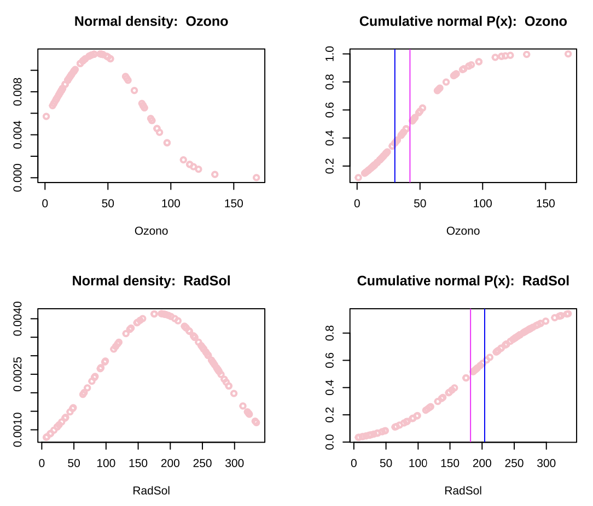

  
# Air Quality Data Analysis: A comprehensive examination

  

## Overview

This project focuses on analyzing air quality data to assess various atmospheric measurements. By applying different data analysis techniques, including data imputation, statistical testing, and graphical visualizations, insights into air quality metrics are uncovered.

## Project Description

This project analyzes air quality measurements from a dataset containing observations of ozone concentration (`Ozono`), solar radiation (`RadSol`), wind speed (`Vient`), temperature (`Temp`), and temporal data: month (`Mes`) and day (`Dia`). The primary goal is to understand the relationship between these variables and their impact on air quality.

## Technologies Used

- **Language:** R
- **Libraries:** `mice` `factoextra` `gridExtra`,`tidyverse`,`visdat`,`dlookr`,`e1071`,`flextable`,`inspectdf`,`qqplotr`,`ggpmisc`, `fdth` and `corrplot`.
- **IDE:** RStudio

## Data Loading

The data is loaded from a CSV file into a dataframe named `air` using the `read.csv()` function. This dataframe contains 100 observations and 6 numeric variables related to air quality measurements.

## Missing Data Study

An initial review of the dataframe was conducted to identify any missing values (NA). The analysis revealed missing values in the `Ozono` and `RadSol` variables, which account for 3.7% of the data.

## Imputation of Missing Values

The `mice` package was utilized to effectively impute missing values, storing the result in a new dataframe called `air_impt`.

## Data Analysis

### Graphical Analysis

- Frequency histograms were created for the numeric variables (`Ozono`, `RadSol`, `Vient`, `Temp`) with mean and median lines to visualize distributions (Figure 1).
- Normal density and cumulative probability graphs were generated for each variable (Figure 2).

**Figure 1: Frequency Histograms**  

  

 

**Figure 2: Normal Density and Cumulative Probability Graphs for RadSol and Vient**  

  

### Mathematical Analysis

- **Hypothesis Testing:** Null and alternative hypotheses were defined to assess normality, applying the Shapiro-Wilk test.
- **Skewness and Kurtosis:** Skewness and kurtosis were calculated to understand the distribution characteristics of the variables.

### Outlier Analysis

Boxplots were utilized to identify outliers in the `Ozono` and `Vient` variables. Outlier significance was assessed using the `flextable(diagnose_outlier())` function.

## Results

The analysis highlighted significant deviations from normality in the `Ozono` and `RadSol` variables. The `Shapiro-Wilk` test confirmed these findings, emphasizing the need for potential transformations in further analysis.

## Conclusions

Missing values were successfully imputed, and the month and day variables were transformed into categorical types. The analysis indicated skewness in some variables, suggesting the necessity for transformations or non-parametric modeling.

## Future Work

To enhance the findings, future efforts will include:
- Applying transformations (e.g., logarithmic or square root) to skewed variables.
- Conducting multivariate analysis to explore relationships between air quality metrics.

